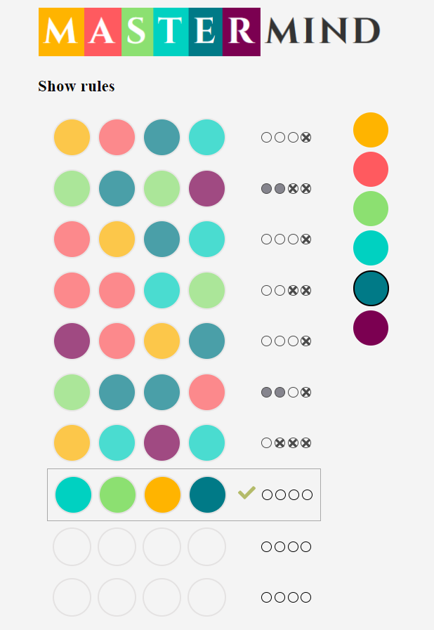

# Mastermind

Mastermind - The classic code breaking game. Do you have what it takes to win?

[Link](https://github.com/sach0499/mastermind)

---

## Screenshot

---

## The Rules of the Game

Try to guess the pattern, in both order and color, within ten rounds. 
Hints are provided at the end of each round by coloring the pegs.
A small black peg is placed for each code peg from the guess which is correct 
in both color and position. A white peg indicates the existence of a correct 
color code peg placed in the wrong position. 

---

## Credits

Credits to [Zosia Korcz](https://zofiakorcz.pl/about.html) for creating a clone of mastermind and inspiring me to remake it. 
Her tutorial about the game is also great.
